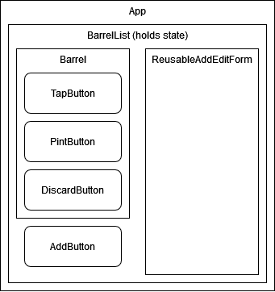

# Ye Olde Barrel Manager
#### _by Aaron Minnick_
### Technologies Used:
* HTML/CSS/Javascript
* React.js

This is my independent project for week 2 of the React curriculum at [Epicodus](https://www.epicodus.com). Ye Olde Barrel Manager is a single-page React app which allows for full CRUD functionality to manage a collection of barrels in a fictional medieval tavern.

Check out the app [here!](https://aaronminnick.github.io/ye-olde-barrel-manager/)

### Setup Instructions:
If you'd like to play with the code on your own computer, follow these instructions:  

* You will need [node.js](https://nodejs.org/en/) for npm.
* Clone this repository to your local repository (the link may be easily obtained using the green "Code" button at the top right corner of this repo):
```
$ git clone https://github.com/aaronminnick/react-ye-olde-barrel-manager.git
```
**Or** you may use the same button to download the files to your computer.

* Install the necessary packages:
```
$ npm install
```
* Run the 'start' script to build and launch a live development server:
```
$ npm run start
```
* Interact with the app!

### React Component Diagram


Here is the component diagram used to plan the app. Local state is managed in a single object component, BarrelList. Components inside others in the diagram receive props from their parent. App wraps the whole program to allow for possible future development which could include other state objects.

### Known Bugs/Issues:
* None

_Thanks for reading! Please feel free to contact me with feedback!_
***
#### [License: MIT](https://opensource.org/licenses/MIT)
#### Copyright (c) 2022 Aaron Minnick